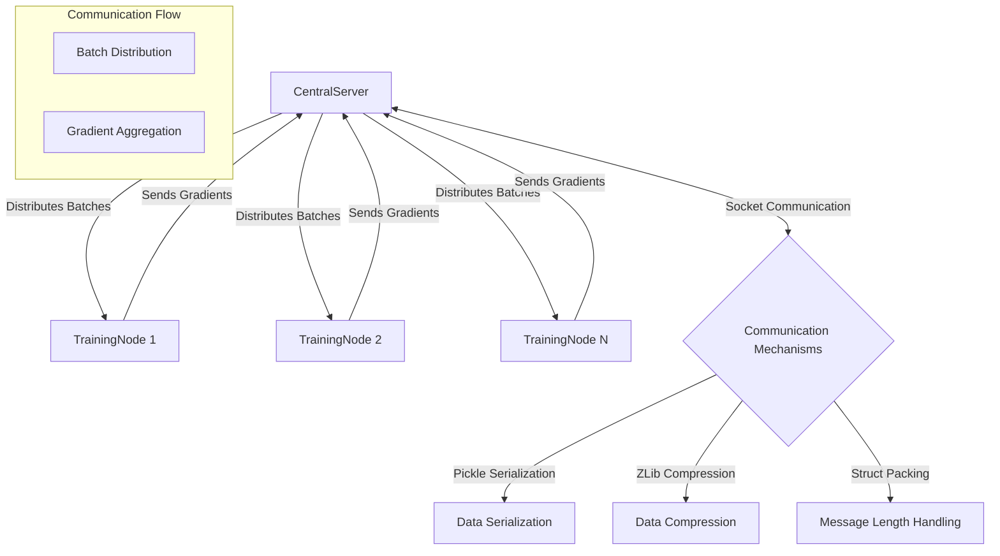

# WIIIIIDE (W5XDE)

[](https://www.youtube.com/watch?v=V-txwi5o3-o)

Drawing inspiration from cryptocurrency mining pools, W5XDE lets you train deep learning models across multiple nodes with ease. WIIIIIDE is designed to be simple to use, yet powerful enough to handle your training needs.

[DOCUMENTATION](docs/classes.md)

## Why WIIIIIDE?

Training deep learning models can be painfully slow. WIIIIIDE is here to (hopefully) change that by offering:

- **Effortless Centralized Deployment**: Set up a central coordinator, and let your nodes do the rest.
- **Peer-to-Peer Communication**: Distribute your training workload across nodes.
- **Plug-and-Play Simplicity**: Get started with minimal configuration headaches. (We hope...)

## Getting Started

### Prerequisites
- Python 3.8+
- PyTorch

### Installation
There are two methods of install.

 `pip install w5xde`, 

 OR

```bash
git clone https://github.com/rndmcoolawsmgrbg/wiiiiide.git
cd wiiiiide
pip install -r requirements.txt
```

More detailed instructions can be found in the [setup guide](docs/setup.md).

## Using WIIIIIDE: It's Incredibly Simple

WIIIIIDE is designed to be straightforward to use. Here's a minimal example to get you started:

### 1. Define Your Model
```python
import torch.nn as nn

class SimpleModel(nn.Module):
    def __init__(self):
        super().__init__()
        self.layers = nn.Sequential(
            nn.Linear(10, 5),
            nn.ReLU(),
            nn.Linear(5, 2)
        )

    def forward(self, x):
        return self.layers(x)
```

### 2. Server Setup
```python
from w5xde import CentralServer
from torch.utils.data import Dataset

# Your dataset should implement the PyTorch Dataset interface
dataset = YourDataset()  
model = SimpleModel()

server = CentralServer(
    model=model,
    dataset=dataset,
    batch_size=32,
    ip="0.0.0.0",  # Use actual IP for remote connections
    port=5555
)
server.start()
```

### 3. Client Setup
```python
from w5xde import TrainingNode

# Create the same model architecture
model = SimpleModel()

# Optional: Define a callback to monitor training
def loss_callback(loss, batch_id):
    print(f"Batch {batch_id}: Loss = {loss:.4f}")

node = TrainingNode(
    model=model,
    server_address=('server_ip', 5555),
    collect_metrics=True
)
node.train(loss_callback=loss_callback)
```

That's it! WIIIIIDE will handle the distributed training process automatically. For a complete working example, check out [test_distributed.py](test_distributed.py).

## How It Works: Behind the Scenes

WIIIIIDE handles training like a pro. Here's a quick look at how it works under the hood:



## Current Limitations

We're transparent about where WIIIIIDE is right now:

- **Network Dependency**: Requires a stable, high-bandwidth connection. (Especially for the central server)
- **Security Considerations**: Very minor forms of encryption are in place.
- **Resource Management**: Recommended to use on dedicated servers.
- **Performance**: We're continually improving and optimizing.
