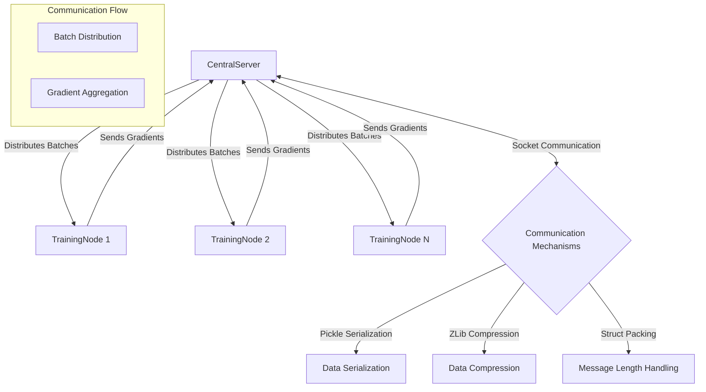

# WIIIIIDE (W5XDE)

[](https://www.youtube.com/watch?v=V-txwi5o3-o)

Drawing inspiration from cryptocurrency mining pools, W5XDE lets you train deep learning models across multiple nodes with ease. WIIIIIDE is designed to be simple to use, yet powerful enough to handle your training needs.

## Why WIIIIIDE?

Training deep learning models can be painfully slow. WIIIIIDE is here to change that by offering:

- **Effortless Centralized Deployment**: Set up a central coordinator and let the magic happen.
- **Smart Peer-to-Peer Communication**: Distribute your training workload intelligently across nodes.
- **Plug-and-Play Simplicity**: Get started with minimal configuration headaches. (We hope....)

## Getting Started

### Prerequisites
- Python 3.8+
- PyTorch

### Installation
Grab the framework with a simple clone and install:

```bash
git clone https://github.com/rndmcoolawsmgrbg/wiiiiide.git
cd wiiiiide
pip install -r requirements.txt
```

## Using WIIIIIDE: It's Incredibly Simple

WIIIIIDE is designed to be straightforward to use. Here's a few examples to get you started:

### Server Setup
```python
from w5xde import CentralServer

server = CentralServer(model, dataset, batch_size=128, ip="0.0.0.0", port=5555)
server.start()
```

### Client Setup
```python
from w5xde import TrainingNode

node = TrainingNode(MODEL_CLASS)
node.train()
```

There you have it! WIIIIIDE will take care of the rest.
If you require a more detailed example, check out [node.py](node.py) and [server.py](server.py).

## How It Works: Behind the Scenes

WIIIIIDE handles training like a pro. Here's a quick look at how it works under the hood:



## Current Limitations

We're transparent about where WIIIIIDE is right now:

- **Central Coordination**: Currently relies on a single central server.
- **Network Dependency**: Requires a stable, high-bandwidth connection.
- **Security Considerations**: No built-in encryption yet - best used on secure networks. (We're going to tackle this soon with enough interest!)
- **Resource Management**: Recommended to use on dedicated servers.
- **Performance**: We're continually improving and optimizing.
